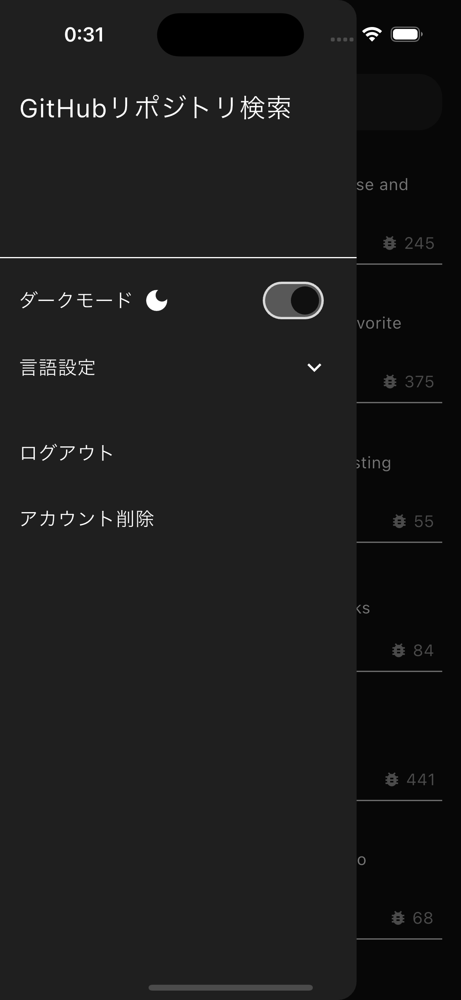

# GitHub リポジトリ検索アプリ

Flutter を使用して開発した GitHub リポジトリ検索アプリケーションです。GitHub API を活用して、キーワードによるリポジトリ検索と、詳細情報の表示を行います。

## 機能一覧

- キーワードによる GitHub リポジトリの検索
- 検索結果の一覧表示 (リポジトリ名など)
- リポジトリ詳細表示 (リポジトリ名、リポジトリ説明文、開発者アイコン、使用言語、Star数、Watcher数、Fork数、Issue数)
- ダークモード対応
- 多言語対応（日本語、英語、中国語、韓国語）
- GitHub認証機能

## スクリーンショット

<!-- アプリのスクリーンショットを追加 -->
<p align="left">
   
   
   
   
   
   
</p>

## 開発環境

- Flutter: 3.13.0以上
- Dart: 3.7.2以上
- 対応OS:
  - iOS: 13.0以上 (iOS 9.0以上が課題要件ですが、一部の使用パッケージの対応状況に合わせて13.0以上としています)
  - Android: 4.1以上

## アーキテクチャ

本アプリケーションは、保守性と拡張性を考慮して以下のアーキテクチャを採用しています：

- **レイヤードアーキテクチャ**: View、Controller、Model、Repository の明確な分離
- **状態管理**: Riverpod を使用したReactive Programmingの実現

### プロジェクト構成

```
lib/
  ├── common_widget/     # 共通ウィジェット
  │    ├── dialog/       # ダイアログ関連
  │    ├── toast/        # トースト通知
  │    └── ...           # その他の共通コンポーネント
  ├── config/            # アプリ設定
  │    ├── locale/       # 多言語設定
  │    ├── routing/      # ルーティング設定
  │    ├── theme/        # テーマ設定
  │    └── util/         # ユーティリティクラス
  ├── feature/           # 機能別モジュール
  │    ├── github/       # GitHub 関連機能
  │    │    ├── controller/  # 状態・ロジック管理
  │    │    ├── model/       # データモデル
  │    │    ├── repo/        # リポジトリ層（API通信など）
  │    │    └── view/        # UI
  │    │         └── part/   # UI要素
  │    └── auth/         # 認証関連機能
  ├── function/          # ユーティリティ関数
  ├── l10n/              # 多言語対応リソース
  │    ├── app_en.arb    # 英語リソース
  │    ├── app_ja.arb    # 日本語リソース
  │    ├── app_ko.arb    # 韓国語リソース
  │    └── app_zh.arb    # 中国語リソース
  └── main.dart          # エントリーポイント
```

## 実装詳細

### GitHub API通信

GitHub APIの`search/repositories`エンドポイントを使用して、リポジトリの検索を行っています。APIクライアントは自作しており、パッケージに依存せずに実装しています。

```dart
// GitHub API呼び出し
Future<List<ApiResponse>> searchGitHubRepo(
  String keyword,
  Uri url,
  Map<String, String> headers,
  BuildContext context,
) async {
  final response = await http.get(url, headers: headers);
  // レスポンス処理...
}
```

### 状態管理

Riverpodを使用して、アプリケーションの状態を管理しています。検索キーワードやAPIレスポンスなどの状態を効率的に扱い、UIとデータの連携を行っています。

### エラーハンドリング

ネットワークエラーや認証エラーなど、様々なシナリオに対応したエラーハンドリングを実装しています。エラーメッセージは多言語対応しており、ユーザーにとって分かりやすい形で表示されます。

### UI/UXの工夫

- データ読み込み中の状態表示
- 処理終了時のステータス表示
- エラー発生時の適切なフィードバック
- 長いテキストは「続きを読む」機能で表示
- ダークモード対応による使いやすさの向上
- シンプルでわかりやすいUI

## 使用技術・パッケージ

- **状態管理**: 
  - **hooks_riverpod/flutter_riverpod**
  - **riverpod_annotation**
  - **flutter_hooks**
- **ルーティング**: 
  - **go_router**
- **API通信**: 
  - **http**
- **データクラス生成**: 
  - **freezed**
  - **json_serializable**
- **UI関連**:
  - **cached_network_image**
  - **readmore**
- **認証・セキュリティ**:
  - **firebase_auth**
  - **flutter_secure_storage**
- **その他**:
  - **shared_preferences**
  - **intl/flutter_localizations**
  - **fluttertoast**

## セットアップと実行方法

1. リポジトリをクローン
```
git clone https://github.com/hayashidareo/search_repositories.git
```

2. 依存関係のインストール
```
flutter pub get
```

3. アプリケーションの実行
```
flutter run
```

## テスト

本プロジェクトでは以下のテストを実装しています：

- 単体テスト : ロジックのテスト
- ウィジェットテスト : UIコンポーネントのテスト

テストの実行:
```
flutter test
```

## アピールポイント

#### 本アプリケーションでは、以下のような技術的な工夫を行っています。

アーキテクチャ面では、MVCパターンに近い構造を採用し、ビュー・ロジック・データの責務を明確に分離しました。これにより、コードの可読性が向上し、機能追加や修正が容易になっています。また、ハードコーディングを避け、定数やスタイルをクラスとして管理することで、一貫性のあるUIと保守性の高いコードベースを実現しています。

ナビゲーション実装にはgo_routerを採用し、宣言的なルーティング定義により画面遷移の管理を簡潔に行っています。これにより、ディープリンクへの対応や履歴管理が容易になり、ユーザー体験の向上につながっています。

UIデザインでは、マテリアルデザインに準拠したダークモード対応を実装しました。自動/手動の切り替え機能を備え、適切な色設定により視認性を確保しています。また、様々な画面サイズや向きに対応するレスポンシブデザインを採用し、フォントサイズやマージンを適切に調整することで、デバイスに依存しない快適な操作性を実現しています。

多言語対応として、日本語、英語、中国語、韓国語の4言語をサポートし、デバイス設定に基づいて自動的にデフォルト言語を選択する機能を実装しました。これにより、ユーザーの母国語でアプリを利用できる快適さを提供しています。

エラーハンドリングにも注力し、API通信エラーを詳細に分類して適切に対応することで、ユーザーに分かりやすいフィードバックを提供しています。また、GitHub認証を統合し、安全性の高い通信を実現することで、ユーザーデータの保護にも配慮しています。

## 今後の改善点

- CI/CDパイプラインの導入
  - 自動テスト、ビルド、デプロイの仕組み構築
- 検索履歴機能の追加
  - 過去の検索キーワードの保存と再利用
- お気に入りリポジトリ機能の追加
  - ユーザーが興味を持ったリポジトリを保存
- UI/UXの向上